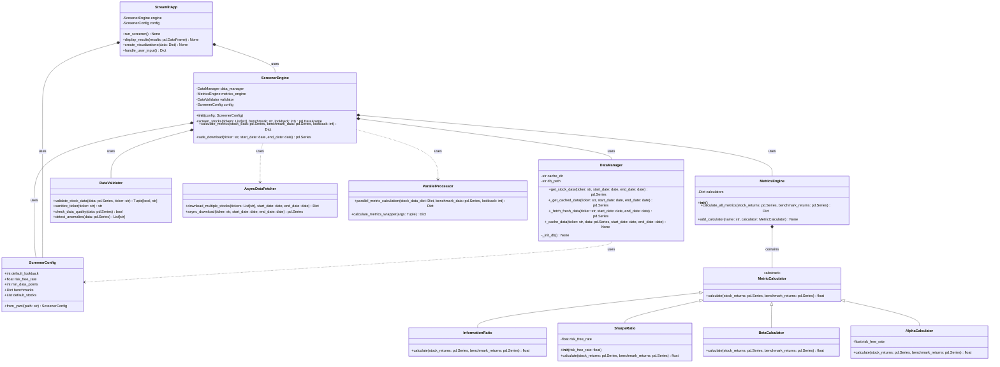
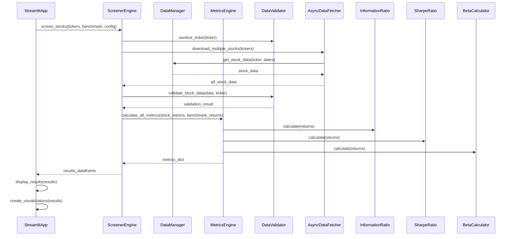

```mermaid

classDiagram
%% Configuration Classes
class ScreenerConfig {
+int default_lookback
+float risk_free_rate
+int min_data_points
+Dict benchmarks
+List default_stocks
+from_yaml(path: str) ScreenerConfig
}

%% Data Management
class DataManager {
-str cache_dir
-str db_path
+get_stock_data(ticker: str, start_date: date, end_date: date) pd.Series
+_get_cached_data(ticker: str, start_date: date, end_date: date) pd.Series
+_fetch_fresh_data(ticker: str, start_date: date, end_date: date) pd.Series
+_cache_data(ticker: str, data: pd.Series, start_date: date, end_date: date) None
-_init_db() None
}

%% Metric Calculation Classes
class MetricCalculator {
<<abstract>>
+calculate(stock_returns: pd.Series, benchmark_returns: pd.Series) float
}

    class InformationRatio {
        +calculate(stock_returns: pd.Series, benchmark_returns: pd.Series) float
    }

    class SharpeRatio {
        -float risk_free_rate
        +__init__(risk_free_rate: float)
        +calculate(stock_returns: pd.Series, benchmark_returns: pd.Series) float
    }

    class BetaCalculator {
        +calculate(stock_returns: pd.Series, benchmark_returns: pd.Series) float
    }

    class AlphaCalculator {
        -float risk_free_rate
        +calculate(stock_returns: pd.Series, benchmark_returns: pd.Series) float
    }

    class MetricsEngine {
        -Dict calculators
        +__init__()
        +calculate_all_metrics(stock_returns: pd.Series, benchmark_returns: pd.Series) Dict
        +add_calculator(name: str, calculator: MetricCalculator) None
    }

%% Validation Classes
class DataValidator {
+validate_stock_data(data: pd.Series, ticker: str) Tuple[bool, str]
+sanitize_ticker(ticker: str) str
+check_data_quality(data: pd.Series) bool
+detect_anomalies(data: pd.Series) List[str]
}

%% Main Application Classes
class ScreenerEngine {
-DataManager data_manager
-MetricsEngine metrics_engine
-DataValidator validator
-ScreenerConfig config
+__init__(config: ScreenerConfig)
+screen_stocks(tickers: List[str], benchmark: str, lookback: int) pd.DataFrame
+calculate_metrics(stock_data: pd.Series, benchmark_data: pd.Series, lookback: int) Dict
+safe_download(ticker: str, start_date: date, end_date: date) pd.Series
}

    class StreamlitApp {
        -ScreenerEngine engine
        -ScreenerConfig config
        +run_screener() None
        +display_results(results: pd.DataFrame) None
        +create_visualizations(data: Dict) None
        +handle_user_input() Dict
    }

%% Performance Classes
class AsyncDataFetcher {
+download_multiple_stocks(tickers: List[str], start_date: date, end_date: date) Dict
+async_download(ticker: str, start_date: date, end_date: date) pd.Series
}

    class ParallelProcessor {
        +parallel_metric_calculation(stock_data_dict: Dict, benchmark_data: pd.Series, lookback: int) Dict
        +calculate_metrics_wrapper(args: Tuple) Dict
    }

%% Relationships
MetricCalculator <|-- InformationRatio
MetricCalculator <|-- SharpeRatio
MetricCalculator <|-- BetaCalculator
MetricCalculator <|-- AlphaCalculator

    MetricsEngine *-- MetricCalculator : contains
    ScreenerEngine *-- DataManager : uses
    ScreenerEngine *-- MetricsEngine : uses
    ScreenerEngine *-- DataValidator : uses
    ScreenerEngine *-- ScreenerConfig : uses

    StreamlitApp *-- ScreenerEngine : uses
    StreamlitApp *-- ScreenerConfig : uses

    ScreenerEngine ..> AsyncDataFetcher : uses
    ScreenerEngine ..> ParallelProcessor : uses

    DataManager ..> ScreenerConfig : uses

```

```mermaid

sequenceDiagram
    participant UI as StreamlitApp
    participant SE as ScreenerEngine
    participant DM as DataManager
    participant ME as MetricsEngine
    participant DV as DataValidator
    participant AF as AsyncDataFetcher

    UI->>SE: screen_stocks(tickers, benchmark, config)
    SE->>DV: sanitize_ticker(ticker)
    SE->>AF: download_multiple_stocks(tickers)
    AF->>DM: get_stock_data(ticker, dates)
    DM-->>AF: stock_data
    AF-->>SE: all_stock_data
    
    SE->>DV: validate_stock_data(data, ticker)
    DV-->>SE: validation_result
    
    SE->>ME: calculate_all_metrics(stock_returns, benchmark_returns)
    ME->>InformationRatio: calculate(returns)
    ME->>SharpeRatio: calculate(returns)
    ME->>BetaCalculator: calculate(returns)
    ME-->>SE: metrics_dict
    
    SE-->>UI: results_dataframe
    UI->>UI: display_results(results)
    UI->>UI: create_visualizations(results)
```